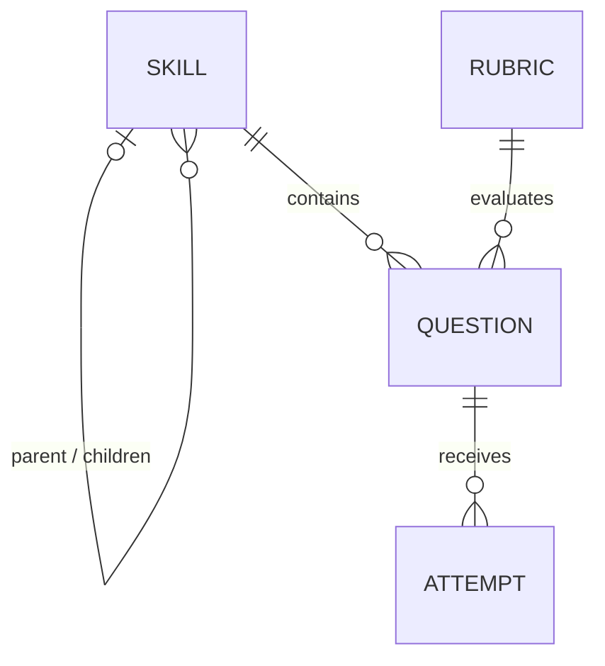

# Skills Practice

Skills Practice is a backend and Model Context Protocol (MCP) server for managing deliberate practice. It is designed to let an AI agent—initially Claude—create and run practice sessions against persistent, queryable data instead of scattering exercises and feedback across unrelated chats.

The project centralizes:

- Skills and their decomposition into independently trainable subskills.
- Reusable questions for first exposure and later reinforcement.
- Stable, shared rubrics that make evaluation mechanical and repeatable.
- Immutable attempts that preserve responses, scores, feedback, and progress over time.

The long-term goal is for an authenticated agent to manage this lifecycle through MCP tools while preserving comparable results across sessions.

## Why this exists

Practice currently happens in separate conversations with no durable state. That makes it difficult to answer basic questions such as:

- Which subskills have already been practiced?
- Is performance improving over time?
- Is a question new or being used for reinforcement?
- Were two responses evaluated with the same criteria?
- Where, specifically, does a learner's reasoning tend to fail?

This repository provides the persistent domain model and MCP transport needed to answer those questions reliably.

## Deliberate-practice principles

The domain is built around a few constraints:

1. A broad skill is decomposed into subskills that can be trained in isolation.
2. Questions belong to leaf skills; intermediate skills are aggregation containers.
3. Feedback is immediate and tied to explicit, discriminating criteria.
4. Rubrics remain stable so scores are comparable across sessions.
5. Questions are reusable. Repeating a question is reinforcement, not duplication.
6. Attempts accumulate as history and are never edited in place.

Rubric criteria should describe observable evidence, not subjective quality. Prefer “mentions the tradeoff and quantifies the cost” over “gives a good answer.”

## Stack

- [AdonisJS](https://adonisjs.com/)
- Lucid ORM
- PostgreSQL
- VineJS
- Model Context Protocol TypeScript SDK
- OAuth 2.0 authorization code flow with PKCE
- Japa for tests

## Architecture

The application exposes an MCP server over Streamable HTTP, protected by OAuth. MCP access tokens are intentionally isolated from regular API tokens.

## Domain model



### `skills`

Skills form a self-referencing tree. A subskill is another skill row; there is no separate subskills table or pivot table.

A root skill has no parent. Questions belong only to leaf skills; intermediate nodes organize the decomposition and aggregate the progress of their descendant leaves. The tree must remain acyclic.

Sibling order is deliberately not part of the domain. Different decompositions may emphasize sequence, components, or error types, so presentation can choose its own ordering.

### `rubrics`

Rubrics are a shared catalog. They are reusable across questions and skills rather than being scoped or duplicated per skill.

Every rubric uses the same criterion-to-points representation, including binary rubrics:

```json
{
  "mentions the tradeoff": 1,
  "quantifies the cost": 2
}
```

Scoring is mechanical: mark the criteria that were fulfilled and sum their points. Once a rubric has been used to score attempts, its criteria must not change. Create a new rubric instead so historical results remain comparable.

### `questions`

Questions are reusable exercises. A prompt is authored once and may be presented repeatedly for reinforcement.

Each question belongs to one leaf skill and uses one rubric. It may include scenario context and an optional reference answer.

- Without a reference answer, the rubric is the complete evaluation criterion.
- With a reference answer, the rubric distributes points across the relevant parts of that answer.
- Reference answers should include reasoning, not only a result. For example: `~1.2K req/s — 100M users × 1 request/day ÷ 86,400`. This makes it possible to identify where the learner's reasoning diverged.

If the same prompt trains two skills, create two questions. Skill ownership belongs to the question, not the attempt.

### `attempts`

Attempts are the immutable practice log.

Each attempt records the learner's response, the rubric-derived score, and immediate feedback. Attempts are appended, not updated.

Whether an attempt is a first exposure or reinforcement is derived by counting earlier attempts for the same question rather than storing additional state.

## Domain invariants

- Prevent cycles in the skill tree.
- Allow questions only on leaf skills.
- Derive each rubric's maximum score from its criteria.
- Prevent changes to rubric data after attempts exist.
- Treat attempts as immutable.
- Score by marking fulfilled criteria and summing their points, rather than assigning a score by judgment.

These rules must remain consistent across every practice session so historical results are comparable.

## Explicit non-goals for now

The following are deliberately out of scope:

- Rubric versioning.
- Shared scenarios as a first-class concept. Reconsider this only if question context starts repeating materially.
- Error-tag taxonomies.
- Scheduling or automatic next-exercise selection.
- Explicit ordering between sibling skills.
- Specialized tree-storage structures; the expected trees are shallow.

## Open design decision

A global score scale has not been selected yet. Before implementing skill-level rollups, all rubrics should use a shared scale—such as `0–3`—so the same numeric score has the same meaning across skills and sessions.

## Local setup

Prerequisites:

- Node.js and npm
- PostgreSQL

Install and configure the application:

```bash
cp .env.example .env
npm install
node ace generate:key
```

Create a PostgreSQL database, update the `DB_*` values in `.env`, and run:

```bash
node ace migration:run
npm run dev
```

The development server uses `http://localhost:3333` by default.

## Quality checks

```bash
npm test
npm run typecheck
npm run lint
npm run format
npm run build
```
